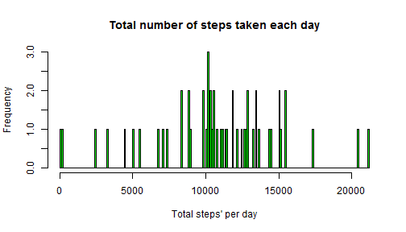

# Reproducible Research: Peer Assessment 1

## Loading and preprocessing the data

The original data was downloaded from [cloudfront](https://d396qusza40orc.cloudfront.net/repdata%2Fdata%2Factivity.zip) at July 21 2014 and was unzipped to working directory. So there is "activity.csv" file in working directory and I am going to read it.

```r
activity <- read.csv("activity.csv", stringsAsFactors=FALSE)
```

Let's preprocess data for futher usage:

- total steps' count by date

```r
totalPerDay <- aggregate(steps ~ date, activity, sum)
print(head(totalPerDay))
```

```
##         date steps
## 1 2012-10-02   126
## 2 2012-10-03 11352
## 3 2012-10-04 12116
## 4 2012-10-05 13294
## 5 2012-10-06 15420
## 6 2012-10-07 11015
```

- average steps' count for 5-minute itervals

```r
averagePerInterval <- aggregate(steps ~ interval, activity, mean)
print(head(averagePerInterval))
```

```
##   interval   steps
## 1        0 1.71698
## 2        5 0.33962
## 3       10 0.13208
## 4       15 0.15094
## 5       20 0.07547
## 6       25 2.09434
```

Also it will be useful to set locale explicitly:

```r
Sys.setlocale("LC_ALL", "English")
```

```
## [1] "LC_COLLATE=English_United States.1252;LC_CTYPE=English_United States.1252;LC_MONETARY=English_United States.1252;LC_NUMERIC=C;LC_TIME=English_United States.1252"
```


## What is mean total number of steps taken per day?

Let's make a histogram of the total number of steps taken each day.

```r
hist(totalPerDay$steps, breaks=200, col="green",
     main="Total number of steps taken each day", xlab="Total steps' per day")
```

 

Let's calculate mean and median of total number of steps taken per day.

```r
meanByDay <- mean(totalPerDay$steps)
medianByDay <- median(totalPerDay$steps)
```
Mean is equal to 1.0766 &times; 10<sup>4</sup> and median is equal to 10765.


## What is the average daily activity pattern?

Let's draw a time series plot of the 5-minute interval and the average number of steps taken, averaged across all days.

```r
plot(averagePerInterval$interval, averagePerInterval$steps,
     type="l", frame=FALSE, col="blue",
     main="Average daily activity",
     xlab="5-minute interval", ylab="Average number of steps")
```

 

Let's define time interval containing the maximum number of steps.

```r
maxStepsCount <- which.max(averagePerInterval$steps)
maxInterval <- averagePerInterval[maxStepsCount,]$interval
```
Interval 835 contains the maximum number of steps (average across all the days).


## Imputing missing values

Let's define the total number of cases with missing values in the original dataset.

```r
missedCasesCount <- sum(is.na(activity$steps))
print(missedCasesCount)
```

```
## [1] 2304
```
You can see there are 2304 missed cases.

Let's create new dataset that is equal to the original dataset but with the missing cases filled in.
Note 2 interesting things about missing cases:

- all missing cases occured at 8 days,
- there is no day with composition of missed and unmissed cases.

Following table demonstates it:

```r
totalObservationPerDay <- length(unique(activity$interval))
print(totalObservationPerDay)
```

```
## [1] 288
```

```r
missedObservationsCountPerDay <- aggregate(steps ~ date, activity, function(x){sum(is.na(x))}, na.action=na.pass)
colnames(missedObservationsCountPerDay) <- c("date", "missedObservationsCount")
print(missedObservationsCountPerDay)
```

```
##          date missedObservationsCount
## 1  2012-10-01                     288
## 2  2012-10-02                       0
## 3  2012-10-03                       0
## 4  2012-10-04                       0
## 5  2012-10-05                       0
## 6  2012-10-06                       0
## 7  2012-10-07                       0
## 8  2012-10-08                     288
## 9  2012-10-09                       0
## 10 2012-10-10                       0
## 11 2012-10-11                       0
## 12 2012-10-12                       0
## 13 2012-10-13                       0
## 14 2012-10-14                       0
## 15 2012-10-15                       0
## 16 2012-10-16                       0
## 17 2012-10-17                       0
## 18 2012-10-18                       0
## 19 2012-10-19                       0
## 20 2012-10-20                       0
## 21 2012-10-21                       0
## 22 2012-10-22                       0
## 23 2012-10-23                       0
## 24 2012-10-24                       0
## 25 2012-10-25                       0
## 26 2012-10-26                       0
## 27 2012-10-27                       0
## 28 2012-10-28                       0
## 29 2012-10-29                       0
## 30 2012-10-30                       0
## 31 2012-10-31                       0
## 32 2012-11-01                     288
## 33 2012-11-02                       0
## 34 2012-11-03                       0
## 35 2012-11-04                     288
## 36 2012-11-05                       0
## 37 2012-11-06                       0
## 38 2012-11-07                       0
## 39 2012-11-08                       0
## 40 2012-11-09                     288
## 41 2012-11-10                     288
## 42 2012-11-11                       0
## 43 2012-11-12                       0
## 44 2012-11-13                       0
## 45 2012-11-14                     288
## 46 2012-11-15                       0
## 47 2012-11-16                       0
## 48 2012-11-17                       0
## 49 2012-11-18                       0
## 50 2012-11-19                       0
## 51 2012-11-20                       0
## 52 2012-11-21                       0
## 53 2012-11-22                       0
## 54 2012-11-23                       0
## 55 2012-11-24                       0
## 56 2012-11-25                       0
## 57 2012-11-26                       0
## 58 2012-11-27                       0
## 59 2012-11-28                       0
## 60 2012-11-29                       0
## 61 2012-11-30                     288
```

So our strategy for filling missing values will be pretty simple: for each "bad" date steps' vector will be replaced with rounded averagePerInterval.

```r
filledActivity <- activity
missingDates <- unique(subset(activity,is.na(steps))$date)
for (date in missingDates)
  filledActivity[filledActivity$date==date,]$steps <- round(averagePerInterval$steps)

print(head(filledActivity,15))
```

```
##    steps       date interval
## 1      2 2012-10-01        0
## 2      0 2012-10-01        5
## 3      0 2012-10-01       10
## 4      0 2012-10-01       15
## 5      0 2012-10-01       20
## 6      2 2012-10-01       25
## 7      1 2012-10-01       30
## 8      1 2012-10-01       35
## 9      0 2012-10-01       40
## 10     1 2012-10-01       45
## 11     0 2012-10-01       50
## 12     0 2012-10-01       55
## 13     0 2012-10-01      100
## 14     1 2012-10-01      105
## 15     0 2012-10-01      110
```

Let's check all NA has been replaced.

```r
print(sum(is.na(filledActivity$steps)))
```

```
## [1] 0
```

Let's repeat the first part of our analysis for new filled dataset: histogram of the total number of steps taken each day, mean and median total number of steps taken per day.


```r
newTotalPerDay <- aggregate(steps ~ date, filledActivity, sum)
par(mfrow=c(1,2))
hist(totalPerDay$steps, breaks=200, col="green", ylim=c(0,9),
     main="Before filling missed values", xlab="Total steps' per day")
hist(newTotalPerDay$steps, breaks=200, col="green", ylim=c(0,9),
     main="After filling missed values", xlab="Total steps' per day")
```

 

Let's see the impact of imputing missed data using average values per interval.
There is new column on second histogram. X value is about average, frequency is higher than usual. This behaviour is expected: we has added several averagePerInterval vectors, which are completely the same (implies high frequency) and contain average for 5-mnute interval across all the days (implies x value is abount center of the mass).  

Let's calculate new mean and median.

```r
newMeanByDay <- mean(newTotalPerDay$steps)
newMedianByDay <- median(newTotalPerDay$steps)
```
Mean is equal to 1.0766 &times; 10<sup>4</sup> and median is equal to 1.0762 &times; 10<sup>4</sup>. Differ from first part (before filling) is insignificant: -0.5493 for mean and -3 for median.


## Are there differences in activity patterns between weekdays and weekends?

It is interesting to compare average weekday and average weekend activity. Let's consider one concrete 5-minute interval and notice how many steps are usually taken at weekday/weekend over this interval.
Let's add special column to easier identifying if observation is weekday or weekend.

```r
weekendObservation <- weekdays(as.Date(filledActivity$date)) %in% c("Saturday","Sunday")
filledActivity$partOfWeek <- ifelse(weekendObservation, "weekend", "weekday")
```

Grouping average steps' count by interval and part of week and getting average patterns:

```r
averageWeekDayPattern <- aggregate(steps ~ interval, subset(filledActivity, partOfWeek=="weekday"), mean)
print(head(averageWeekDayPattern))
```

```
##   interval   steps
## 1        0 2.28889
## 2        5 0.40000
## 3       10 0.15556
## 4       15 0.17778
## 5       20 0.08889
## 6       25 1.57778
```

```r
averageWeekEndPattern <- aggregate(steps ~ interval, subset(filledActivity, partOfWeek=="weekend"), mean)
print(head(averageWeekEndPattern))
```

```
##   interval steps
## 1        0  0.25
## 2        5  0.00
## 3       10  0.00
## 4       15  0.00
## 5       20  0.00
## 6       25  3.50
```

Plotting it for easy and intuitive comparison:

```r
par(mfrow=c(2,1))
plot(x=averageWeekDayPattern$interval, y=averageWeekDayPattern$steps,
     main="Average number of steps at weekday", xlab="5-minute interval's number", ylab="",
     type='l', ylim=c(0,200), frame=FALSE)
plot(x=averageWeekEndPattern$interval, y=averageWeekEndPattern$steps,
     main="Average number of steps at weekend", xlab="5-minute interval's number", ylab="",
     type='l', ylim=c(0,200), frame=FALSE)
```

 

So we can notice:

- a little bit later starting and ending of activity at weekends;
- bigger intensity of activity during the day at weekends.
